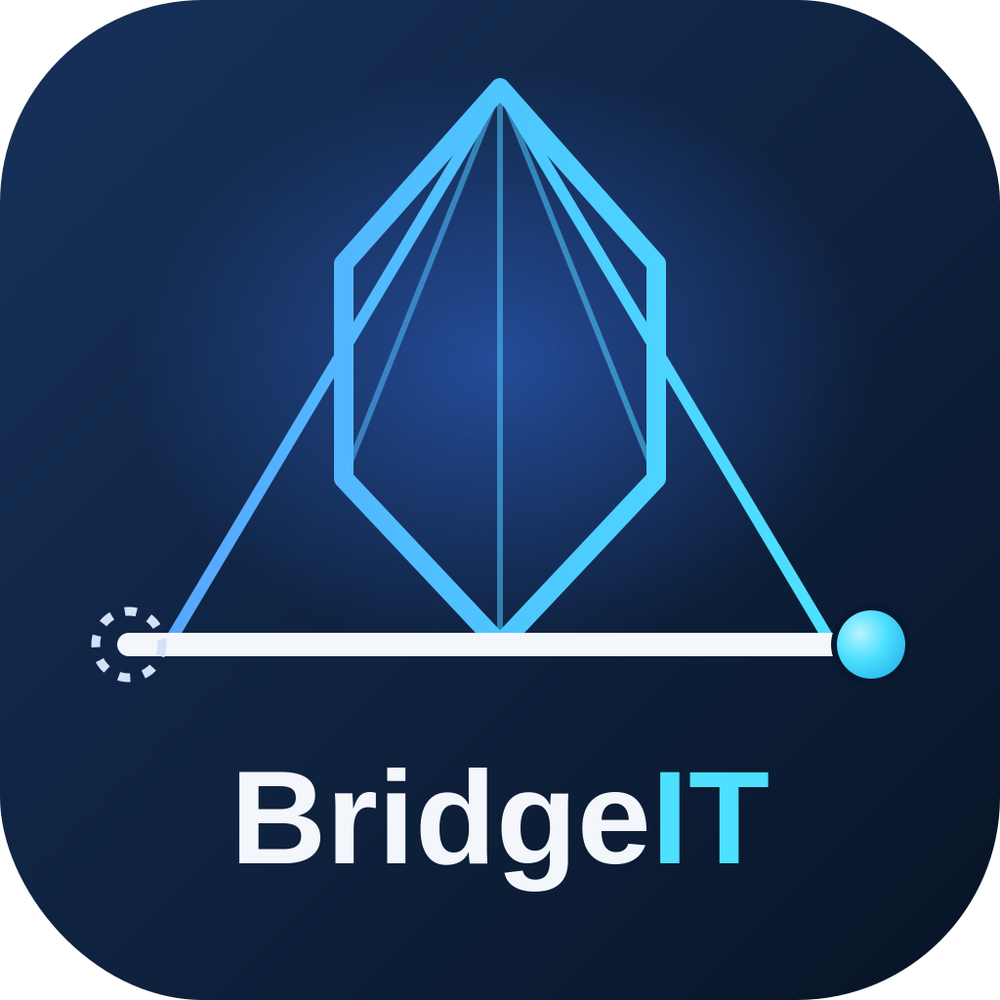

# BridgeIT

## Authors

- [Martina Fava](mailto:martina.fava3@studio.unibo.it)
- [Nicole Tresca](mailto:nicole.tresca@studio.unibo.it)

## Abstract

BridgeIT is a Requirements Engineering platform that helps business stakeholders and software engineers turn natural-language requirements into structured, traceable software artifacts. Requirements Engineering is one of the most critical and error-prone disciplines in software development: requirements originate as informal, ambiguous statements, and translating that intent into unambiguous, engineering-ready specifications is a well-documented source of project failure.

BridgeIT uses Artificial Intelligence to assist this translation — flagging ambiguity, proposing structure, and suggesting revisions — but AI never decides autonomously. Every AI-generated suggestion is a proposal that requires explicit human validation before it can affect the authoritative state of a requirement. This distinction is what separates BridgeIT from a generic AI chatbot: it is built around an explicit domain model, a defined lifecycle (submission, AI-assisted analysis, human validation), and an architecture that keeps every AI-assisted suggestion reviewable, attributable, and traceable to its origin.

The platform follows Domain-Driven Design and Hexagonal Architecture, isolating the domain and application logic from external technical concerns (the web framework, persistence, and the AI provider) behind explicit ports. Access to the AI provider (the Gemini API) is mediated entirely through a dedicated AI Gateway abstraction, so the domain has no dependency on any specific AI provider.

The backend is implemented in Python with FastAPI, backed by a SQLite database. The frontend is a lightweight web client (plain HTML, CSS, and JavaScript, no framework), consuming the backend exclusively through its REST API. The project is developed for the Software Engineering course of the DTM master's degree at the University of Bologna, with automated testing across all architectural layers, static analysis, and a fully automated CI/CD pipeline enforcing Conventional Commits and Semantic Versioning.

## Disclaimer

During the preparation of this work, the authors used **Claude** (Anthropic) as an AI coding assistant. Its use is detailed per-author in the artifact repository's `AI-DECLARATION.md`. In general terms: architectural principles were dictated by the course requirements; within them, the AI provided technical analysis and recommendations, but every design decision, every applied change, and every commit was reviewed and made by the authors, who take full responsibility for the content of the final report and artifact.
