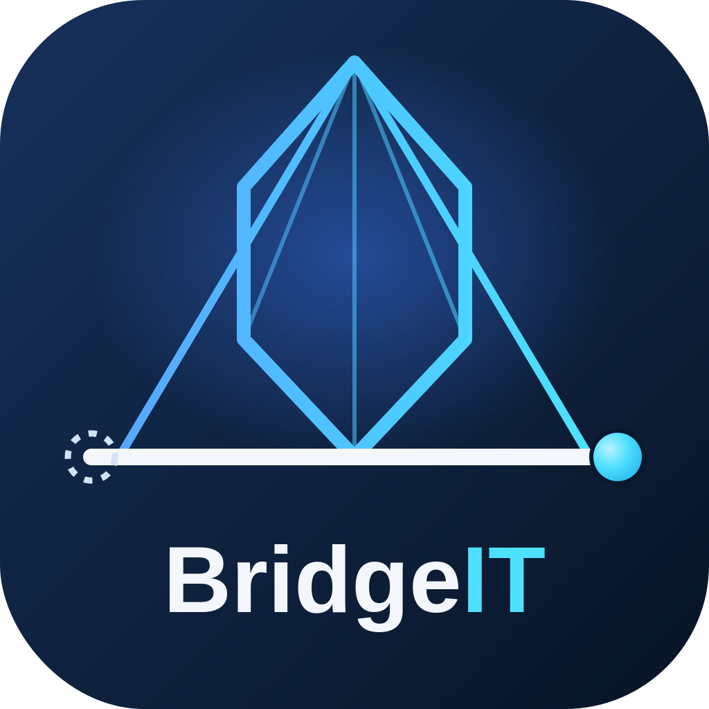

# BridgeIT

## Authors

- [Martina Fava](mailto:martina.fava3@studio.unibo.it)
- [Nicole Tresca](mailto:nicole.tresca@studio.unibo.it)

## Abstract

BridgeIT is a Requirements Engineering platform that supports the lifecycle of natural-language requirements through AI-assisted quality analysis and explicit human validation. Requirements Engineering is one of the most critical and error-prone disciplines in software development: requirements often originate as informal or ambiguous statements, and refining that intent into clear, engineering-ready specifications is a significant challenge.

BridgeIT uses Artificial Intelligence to assist this process by identifying potential ambiguity, incompleteness, and other quality issues. AI never decides autonomously: every analysis is advisory, and the authoritative outcome of a requirement remains under explicit human control. The current release focuses on the core lifecycle of requirement submission, AI-assisted analysis, clarification, and human validation; richer traceability links and derived artifacts remain future extensions.

The platform follows Domain-Driven Design and Hexagonal Architecture, isolating the domain and application logic from external technical concerns (the web framework, persistence, and the AI provider) behind explicit ports. Access to the AI provider (the Gemini API) is mediated entirely through a dedicated AI Gateway abstraction, so the domain has no dependency on any specific AI provider.

The backend is implemented in Python with FastAPI, backed by a SQLite database. The frontend is a lightweight web client (plain HTML, CSS, and JavaScript, no framework), consuming the backend exclusively through its REST API. The project is developed for the Software Engineering course of the DTM master's degree at the University of Bologna, with automated testing across all architectural layers, static analysis, and a fully automated CI/CD pipeline enforcing Conventional Commits and Semantic Versioning.

## Disclaimer

During the preparation of this work, the authors used **Claude** (Anthropic) and **ChatGPT** (OpenAI) as AI assistants, and also used generative AI during parts of project planning and intermediate review. Their use is described in the [Usage of Generative AI](sections/13-genai/index.md) chapter. Architectural principles were dictated by the course requirements; within them, AI provided technical analysis and recommendations, but every design decision, every applied change, and every commit was reviewed and made by the authors, who take full responsibility for the content of the final report and artifact.
