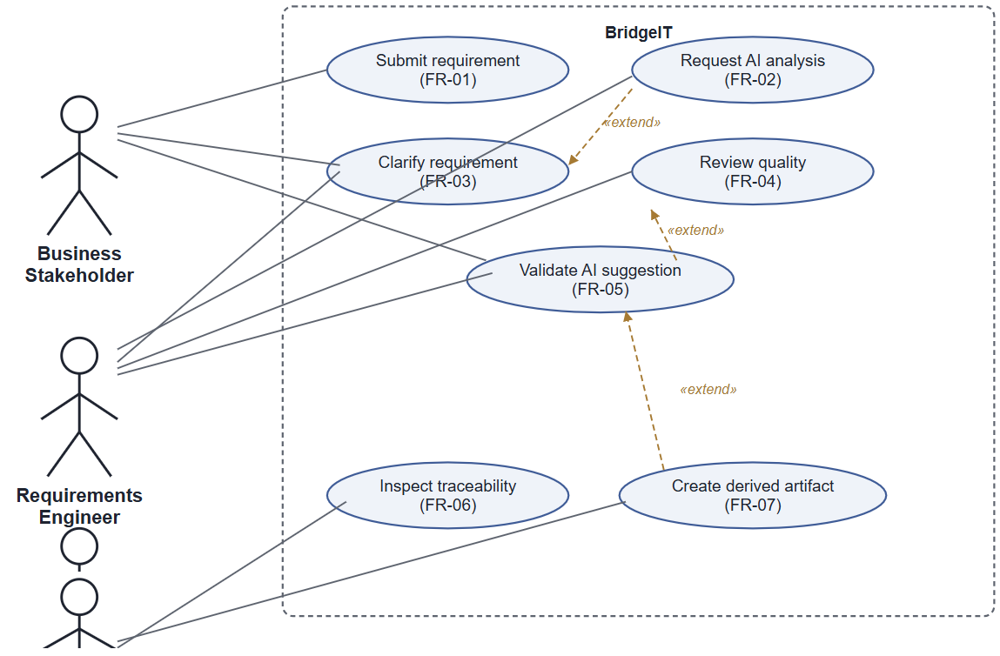

# Requirements

## User stories

- As a Business Stakeholder, I want to submit a requirement in natural language, so that my intent is captured as a structured artifact I can later review.
- As a Requirements Engineer, I want the platform to analyze a requirement for ambiguity or incompleteness, so that I can identify issues before the requirement is validated.
- As a Business Stakeholder or Requirements Engineer, I want to revise a requirement's wording after an analysis has surfaced an issue, so that the requirement can be improved before validation.
- As a Requirements Engineer, I want to see a quality indication for a requirement, so that I can decide whether it needs further clarification.
- As a Business Stakeholder or Requirements Engineer, I want to explicitly approve, edit, or reject any AI-generated suggestion, so that no interpretation of my requirement becomes authoritative without my consent.
- As a Software Engineer, I want to inspect which artifacts are linked to a given requirement, so that I understand the origin of what I am implementing.
- As a Software Engineer, I want to create a derived artifact from a validated requirement, so that I can begin implementation work with a clear, traceable link back to its source.

## Requirements analysis

### Functional

- F1: the user must be able to submit a requirement expressed in natural language, having it stored as a structured, persistent artifact with a unique identifier
- F2: the system must use the AI Gateway to analyze a submitted requirement's text and identify potential quality issues (ambiguity, incompleteness)
- F3: the user must be able to revise a requirement's wording after an analysis has surfaced an issue, keeping the same identifier across the revision
- F4: the system must produce a quality indication for a requirement, distinguishing at least "ready for validation" from "needs clarification"
- F5: the user must explicitly approve, edit, or reject any AI-generated suggestion before it can affect the requirement's authoritative state
- F6: the user must be able to create and inspect traceability links between a requirement and the artifacts derived from it 
- F7: the user must be able to create a derived, structured artifact from a validated requirement, preserving its link to the source requirement 

### Non-functional

- NF1: changes to one concern (e.g. persistence, AI provider) must not require changes to unrelated parts of the system
- NF2: domain and application logic must be verifiable through automated tests independently of external infrastructure
- NF3: the system must be composed of clearly bounded modules with explicit responsibilities, consistent with DDD and Hexagonal Architecture
- NF4: AI capability must be accessed through an abstraction (the AI Gateway) allowing the provider to be replaced without affecting domain or application logic
- NF5: AI provider credentials must never be embedded in source code or version control
- NF6: new requirement-derived artifact types or AI-assisted capabilities must be introducible without restructuring existing modules
- NF7: failures in an external dependency (e.g. AI provider unavailability) must not corrupt or lose previously stored requirement data
- NF8: failures in external dependencies must surface a clear, actionable indication rather than an unhandled failure
- NF9: environment-specific settings (e.g. AI provider credentials) must be externalized from the codebase
- NF10: significant domain events must be logged to support debugging, without logging sensitive content in plaintext

### Implementation

- I1: the system must use SQLite as its DBMS, mandated by the course once the team grew to two members
- I2: the system must provide a web or desktop frontend, mandated by the course for the same reason

All other technical choices (`sqlite3` over an ORM, vanilla HTML/CSS/JavaScript over a frontend framework, FastAPI, Gemini as the AI provider, etc.) are design decisions made to satisfy the requirements above, not externally imposed constraints, they are discussed and justified in the Design section instead.

## Glossary

- **Requirement**: a single unit of business or system intent, originally expressed in natural language, tracked through its lifecycle from submission to validation
- **AI Analysis**: the outcome of an AI-assisted evaluation of a requirement's text, including a quality indication and, where applicable, a suggested revision — always a proposal, never an automatic change
- **Derived Artifact**: a structured, engineering-facing object (e.g. a backlog item) created from a validated requirement, retaining an explicit reference back to it
- **Traceability Link**: an explicit, inspectable relationship connecting a requirement to a derived artifact or another object derived from it
- **Quality Indication**: a non-binding assessment of a requirement's clarity, completeness, and freedom from ambiguity, intended to guide — not replace — human judgment
- **Validation**: the explicit human decision (approve, edit, or reject) required before an AI suggestion can affect a requirement's authoritative state

## Acceptance Criteria for the requirements

- F1: given a non-empty description, submitting it stores a requirement with a unique identifier and an initial status; retrieving it later returns the stored text unchanged
- F2: given a requirement eligible for analysis, requesting one produces an AI analysis associated with its identifier, without altering the requirement's stored text or status
- F3: revising a requirement's text keeps its identifier unchanged; the relationship between the original submission and the revision remains identifiable
- F4: a quality indication distinguishes at least "ready for validation" from "needs clarification"; producing one does not, by itself, change the requirement's status
- F5: an AI analysis awaiting review does not affect the requirement's authoritative state until a human decision is recorded; the recorded decision is retrievable together with the requirement
- F6: a traceability link between a requirement and a derived artifact is retrievable by querying either side of the relationship
- F7: an artifact created from a requirement whose status is "Validated" retains an explicit reference to it; creation is refused for a requirement not yet Validated
- NF1-NF10: verified through automated tests at the domain, application, and infrastructure layers (see Validation section) and through manual inspection of the codebase's module boundaries
- I1: the persistence adapter connects to and correctly reads/writes a SQLite database file, verified by integration tests
- I2: the frontend is reachable through a standard web browser and successfully completes the full requirement lifecycle against the running API
